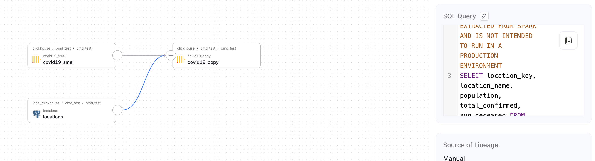

# Spark Lineage Tracker


> ⚠️ This project is in **early stages** and has **not been tested in production**. Use with caution.

> ⚠️ This is not a replacement for the [official spark-openmetadata](https://docs.open-metadata.org/latest/connectors/ingestion/lineage/spark-lineage) connector and is meant to be used IN CONJUNCTION with it. They each do different things.

A Spark 3.x listener that automatically tracks **JDBC reads/writes** and stores lineage in your data governance system.  
Default implementation integrates with [OpenMetadata](https://open-metadata.org/).

---
## Tested With

- OpenMetadata server: `openmetadata/server:1.8.6`
- Spark: 3.5.0
- Scala: 2.12

## Features
- 📡 Capture Spark JDBC reads/writes automatically
- 🏷️ Pluggable transport layer (`TransportTrait`) for custom governance frameworks
- 🔌 OpenMetadata integration out-of-the-box

---

## Quick Start

Run your Spark job with the lineage tracker JAR:

```bash
spark-submit \
  --jars spark-lineage-listener-0.0.1-SNAPSHOT.jar \
  --class io.github.amrnablus.MySparkApp \
  my-spark-job.jar
```

---

## Implementing a Custom Tracker

To override the default OpenMetadata tracker, you need to:

1. Implement `TransportTrait`.
    - Main method: `trackLineage`
    - Optionally override `requireParam` to validate Spark session parameters

2. Override both `transport.type` and `transport.class` when creating your Spark session:
    - `transport.type` → a unique readable name for the transport class
    - `transport.class` → FQDN of your `TransportTrait` implementation (e.g. `io.github.myuser.myLineageImplementation`)

3. Feel free to create a PR for your implementation if you'd like it added here.

---

## Configuration

| Config key | Description | Example |
|------------|-------------|---------|
| `io.github.amrnablus.sparklineage.transport.type` | Identifier for transport | `openmetadata` |
| `io.github.amrnablus.sparklineage.transport.class` | FQDN of your transport implementation | `io.github.amrnablus.sparklineage.transport.openmetadata.OpenMetadataLineageClient` |
| `io.github.amrnablus.sparklineage.transport.openmetadata.apiUrl` | OpenMetadata API URL | `http://localhost:8585/api/v1` |
| `io.github.amrnablus.sparklineage.transport.openmetadata.apiKey` | OpenMetadata API Key | `my-api-key` |

---

## Build Instructions

This project uses Maven. To build:

```bash
mvn clean package
```

This creates a fat JAR in the `target` directory.

To use it as a Maven/SBT dependency:

1. Install locally:
   ```bash
   mvn install
   ```
2. Add the dependency in your `pom.xml`:
   ```xml
   <dependency>
       <groupId>io.github.amrnablus</groupId>
       <artifactId>spark-lineage-listener</artifactId>
       <version>0.0.1-SNAPSHOT</version>
   </dependency>
   ```
3. Or add the JAR directly with Spark’s `--jars` option.

---

## Usage Example

```scala
package io.github.amrnablus

import io.github.amrnablus.sparklineage.listener.LineageTracker
import org.apache.spark.sql.{SaveMode, SparkSession, functions}

object MySparkApp {
  def main(args: Array[String]): Unit = {
    val spark = SparkSession
      .builder()
      .appName("Spark4ListenerExample")
      .master("local[*]")
      .config("io.github.amrnablus.sparklineage.transport.type", "openmetadata")
      .config(
        "io.github.amrnablus.sparklineage.transport.class",
        "io.github.amrnablus.sparklineage.transport.openmetadata.OpenMetadataLineageClient"
      )
      .config(
        "io.github.amrnablus.sparklineage.transport.openmetadata.apiUrl",
        "http://localhost:8585/api/v1"
      )
      .config(
        "io.github.amrnablus.sparklineage.transport.openmetadata.apiKey",
        "my-api-key"
      )
      .getOrCreate()

    // Register the listener
    spark.sparkContext.addSparkListener(new LineageListener)

    val locationsDF = spark.read
      .format("jdbc")
      .option("url", "jdbc:clickhouse://localhost:8123/omd_test")
      .option("dbtable", "omd_test.locations")
      .option("driver", "com.clickhouse.jdbc.ClickHouseDriver")
      .option("user", "default")
      .option("password", "")
      .load()

    val readDF = spark.read
      .format("jdbc")
      .option("url", "jdbc:clickhouse://localhost:8123/omd_test")
      .option("dbtable", "covid19_small")
      .option("driver", "com.clickhouse.jdbc.ClickHouseDriver")
      .option("user", "default")
      .option("password", "")
      .load()

    val cachedDF = readDF
      .cache()
      .filter(functions.col("location_key") === "PSE")

    val aggDF = cachedDF
      .groupBy("location_key")
      .agg(
        functions.sum("new_confirmed").alias("total_confirmed"),
        functions.avg("new_deceased").alias("avg_deceased")
      )

    val resultDF = aggDF
      .join(
        locationsDF,
        aggDF("location_key") === locationsDF("location_id"),
        "inner"
      )
      .select(
        aggDF("location_key"),
        functions.col("location_name"),
        functions.col("population"),
        functions.col("total_confirmed"),
        functions.col("avg_deceased")
      )

    resultDF.write
      .format("jdbc")
      .option("url", "jdbc:clickhouse://localhost:8123/omd_test")
      .option("dbtable", "covid19_copy")
      .option("driver", "com.clickhouse.jdbc.ClickHouseDriver")
      .option("user", "default")
      .option("password", "")
      .mode(SaveMode.Append)
      .save()

    spark.stop()
  }
}
```

Running the code above will generate lineage for your `omd_test.omd_test.covid19_copy` table:



---

## Contributing

Contributions, issues, and feature requests are welcome!  
Please open an issue or PR on GitHub.

---

## License

This project is licensed under the [Apache License 2.0](LICENSE) © 2025 Amr Shahin.
